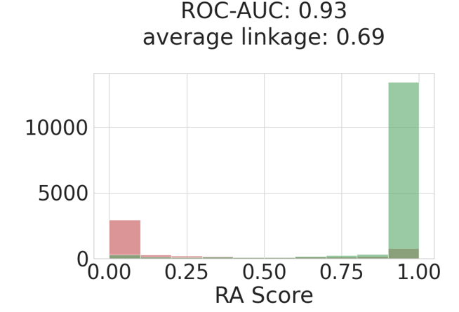
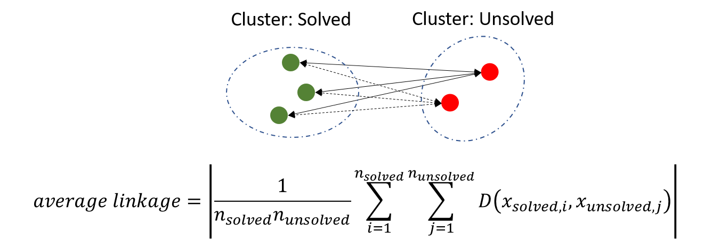

# Retrosynthetic Accessibility (RA) score
 * RAscore is a score learned from the predictions of a computer aided synthesis planning tool (AiZynthfinder: https://github.com/MolecularAI/aizynthfinder). 
 * **RAscore is intended to be a binary score, indicating whether the underlying computer aided synthesis planning tool can find a route (1) or not (0) to a given compound.** 
 * The tool has been trained on 200,000 compounds from ChEMBL and so is limited to compounds within similar regions of chemical space. It is intended to predict the retrosyntehtic accessibility of bioactive molecules.
 * Attempts to use the score on more exotic compounds such as those found in the GDB databases will not work.


## Installation 

Follow the steps in the defined order to avoid conflicts.

1. Create an environment (note: the python version must be >=3.7):
`conda create --name myenv python=3.7`

or use an existing environment 

2. Install rdkit 2020.03 and tensorflow 2 (if already installed skip this step)
```
conda install -c rdkit rdkit -y
conda install -c anaconda tensorflow>=2.1.0 -y
```

3. Clone the RAscore repository 
`git clone https://github.com/reymond-group/RAscore.git`

change directory to the repository
`cd RAscore`

4. Install RAscore
`python -m pip install -e .`

If you want to retrain models, or train your own models using the hyperparameter optimisation framework found in the 'model_building' folder, then the following should be installed in the environemnt also:
`pip install -r requirements.txt`

The SYBA, SCscore and SAscore should also be downloaded for descriptor calculations and training scripts modified to reflect the locations of the models:
https://github.com/lich-uct/syba
https://github.com/connorcoley/scscore
https://github.com/rdkit/rdkit/tree/master/Contrib/SA_Score

## Usage
```
from RAscore import RAscore
scorer = RAscore.RAScorer('<path-to-repo>/RAscore/RAscore/model/model.h5')

#Imatinib mesylate
scorer.predict('CC1=C(C=C(C=C1)NC(=O)C2=CC=C(C=C2)CN3CCN(CC3)C)NC4=NC=CC(=N4)C5=CN=CC=C5.CS(=O)(=O)O')
0.99522984

#Omeprazole
scorer.predict('CC1=CN=C(C(=C1OC)C)CS(=O)C2=NC3=C(N2)C=C(C=C3)OC')
0.99999106

#Morphine - Illustrates problem synthesis planning tools face with complex ring systems
scorer.predict('CN1CC[C@]23c4c5ccc(O)c4O[C@H]2[C@@H](O)C=C[C@H]3[C@H]1C5')
8.316945e-07
```

## Performance on Test Set
* Test set contains ca. 20,000 compounds from ChEMBL
* The model was able to separate clusters of solved/unsolved compounds as found by computing the average linkage
* RAscore can better differentiate between solved/unsolved compounds than existing methods.


## Computation of Average Linkage 
